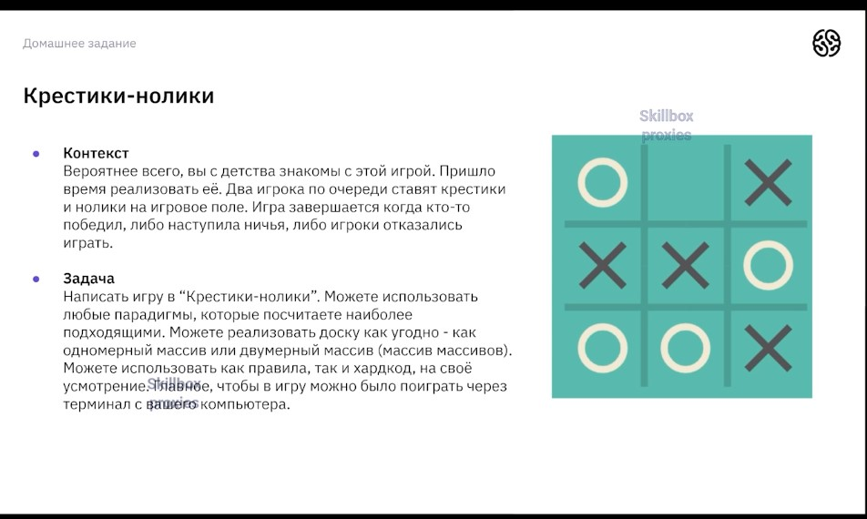
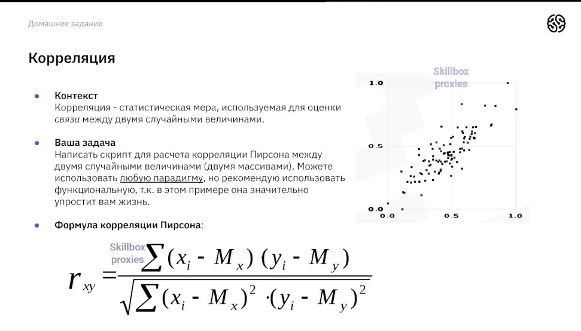
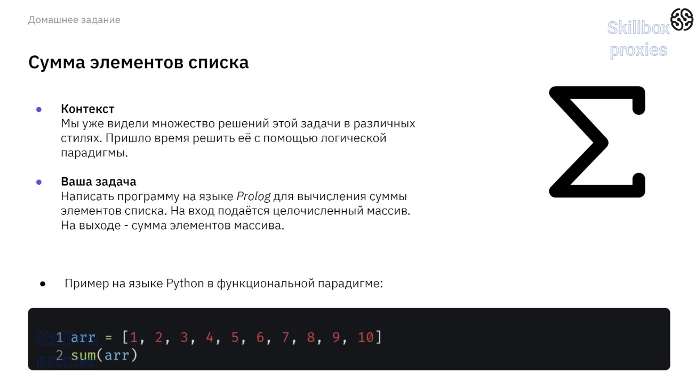

# Парадигмы программирования и языки парадигм

## Урок 1. Императивное и декларативное программирование на практике

## Урок 2. Структурное и процедурное программирование на практике

## Урок 3. ООП на практике

## Урок 4. Функциональное программирование

## Урок 5. Логическое программирование

